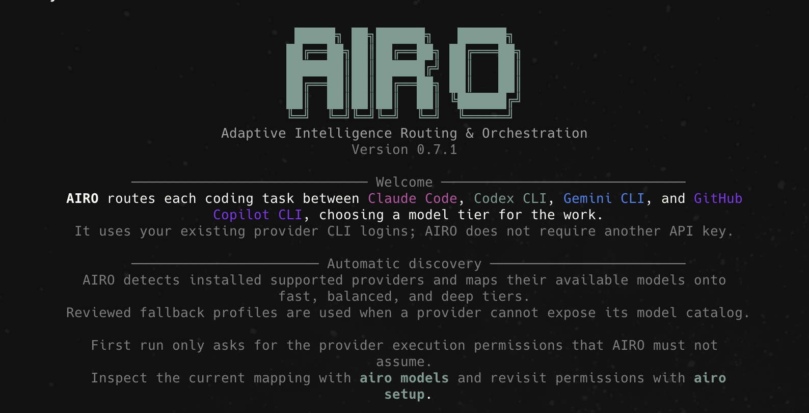

<h1 align="center">AIRO</h1>

<p align="center">
  
</p>

<p align="center">Adaptive Intelligence Routing &amp; Orchestration for coding-agent CLIs.</p>

<p align="center">
  <a href="https://www.npmjs.com/package/airo-ai-router"></a>
  <a href="https://www.npmjs.com/package/airo-ai-router"></a>
  <a href="https://github.com/pablospaniard/airo-cli/actions/workflows/ci.yml"></a>
  <a href="https://github.com/pablospaniard/airo-cli/blob/main/LICENSE"></a>
  <a href="https://github.com/sponsors/pablospaniard"></a>
</p>

AIRO accepts a task, chooses the right provider and model tier, and can coordinate a multi-phase workflow across agents. It runs locally with your existing CLI logins—no separate model API keys or proxy service required.

The official npm package is [`airo-ai-router`](https://www.npmjs.com/package/airo-ai-router). Install it globally to use the `airo` command; `ai-router`, `airoute`, and `ai-route` are retained as compatibility aliases.

```text
request → route → analyze → implement → test → review
                    Claude     Codex      Codex   Claude
```

## Why AIRO

- Routes each request independently using task signals, custom rules, and prior feedback.
- Maps work onto configurable `fast`, `balanced`, and `deep` model tiers.
- Hands complex tasks between supported provider CLIs through a shared working tree.
- Preserves logical session context even when the provider changes between turns.
- Streams structured progress while keeping hidden reasoning private.
- Separates live progress from the provider's final result.
- Persists phase logs, final output, routing history, and user feedback locally.
- Inserts a recovery phase when a workflow fails or reports an unresolved problem.

<p align="center">
  
</p>

## Decision routing in practice

<p align="center">
  
</p>

AIRO makes a new routing decision for every phase, not just the job as a whole. A production fix can split into parallel investigations and rejoin for a patch, while a new capability can loop back through another build pass when review changes the task.

That means one job can be served by multiple models and providers, and another run can use a different order—or skip phases entirely—when the task calls for it. Model A, Model B, and Model C are illustrative abstractions, not fixed roles or providers; model selection is configurable around what is available to your account.

### Built for the way agent work actually happens

- **Seamless local integration.** Keep using the supported provider CLI accounts you already have. AIRO runs in your repository, keeps the shared working tree, and needs no proxy, copied API keys, or separate hosted workspace.
- **Adaptive multi-model workflows.** AIRO can assign a different provider and model tier to analysis, implementation, validation, and review, including provider-supported effort controls—then add a recovery phase only when the evidence calls for it.
- **Measured token efficiency.** Fast or balanced models handle routine work while deep models are reserved for difficult phases. `airo usage` reports provider telemetry and a clearly labeled historical estimate against comparable default-model runs.
- **Sessions that survive context switches.** Continue a logical task even when the provider changes, restore past sessions, and keep concise task outcomes rather than exposing hidden reasoning.
- **A real VS Code workspace.** The included extension provides a sidebar chat, rich phase indicators, attachments, session history, and parallel editor chats. Open a new chat without stopping an active one; the history view marks running chats so you can jump back to them.

## Get started

1. Install Node.js 22 or newer, then install and sign in to any supported provider CLI: Claude Code, Codex CLI, Gemini CLI, and/or GitHub Copilot CLI. AIRO uses those existing CLI logins—there are no AIRO API keys to create. The provider CLIs must be installed; AIRO invokes them as subprocesses.
2. Install AIRO and check your local setup:

   ```bash
   npm install --global airo-ai-router
   airo doctor
   ```

3. Launch AIRO. On the first interactive launch, choose models for the `fast`, `balanced`, and `deep` tiers (press Enter to keep the suggested defaults).

   ```bash
   airo
   ```

4. Enter a task, or run one directly from your shell:

   ```bash
   airo "review this PR for regressions"
   ```

### VS Code sidebar (preview)

The repository includes a VS Code extension in [`vscode-extension`](vscode-extension). Run `pnpm install` from the repository root, open the extension folder in VS Code, then press `F5` to launch an Extension Development Host. Its secondary-sidebar view is a stateful AIRO chat with visual workflow phases, provider-colored activity, attachments, inline previews for generated images, and controls for models, accounts, usage, logs, diagnostics, and feedback. Generated local files are exposed as clickable artifacts, including paths outside the current workspace. Use **New chat** to open an independent editor chat while another one runs; use **Previous chats** to restore or switch to saved chats, with active work clearly marked. Configure the executable, routing mode, provider, tier, and output detail under VS Code’s **AIRO** extension settings.

The extension invokes the AIRO CLI, so `airo-ai-router` must be installed (or the repository must be linked locally) in addition to any provider CLI. Provider CLIs do not need to be installed in a standard location, but every executable must be reachable either through `PATH` or an explicit command path. If VS Code cannot find `airo`, set **AIRO: Command** to the absolute path of the AIRO executable, such as `/Users/me/.local/bin/airo` or `/opt/homebrew/bin/airo`. The same setting is used by the sidebar and the **AIRO: Open Terminal** command.

Automatic fallback considers every registered provider. AIRO ranks alternatives by their score for the current task, then uses the registry's stable Claude → Codex → Gemini → Copilot priority to break ties. Missing-provider fallback checks command availability. After an authentication or usage-limit failure, AIRO also skips a candidate when its adapter can confirm that its account is signed out; Gemini and Copilot currently have no account probe, so their authentication state remains unknown until execution.

A handover is announced the moment it happens: the CLI prints the new provider, and the VS Code sidebar repaints its header chip, phase chip, and activity accent and adds a short note explaining the change. An explicit choice is never substituted: if you pin a provider with `--agent`, `--model`, `/agent`, the VS Code provider setting, or by naming it in the prompt, AIRO uses that provider only and fails with a clear error instead of switching. Run `airo setup` at any time to revisit the model choices.

## Common workflows

Open the interactive workspace:

```bash
airo
```

The workspace shows the active session, provider availability, routing preferences, and output mode. Type a task directly or use `/help` to discover commands. Tab completion is available for slash commands.

Start a session:

```bash
airo "review this PR for regressions"
```

Continue it with a newly routed follow-up:

```bash
airo --continue "fix the critical issue you found"
```

Force one agent or an adaptive workflow:

```bash
airo --single "rename this interface"
airo --adaptive "investigate and fix this intermittent failure"
```

### Workflow modes: automatic, adaptive, or single

`auto` is the default: AIRO reads the request and uses a multi-phase workflow for work that looks broad, risky, complex, review-oriented, or long; it keeps a simple request in one focused run. Choose `adaptive` to always plan phases, or `single` when you want one routed agent to own the task (see the `--single`/`--adaptive` examples above).

In an adaptive run, AIRO plans only the phases the task needs—typically **Analyze → Implement → Validate → Review**. Each phase is routed independently: for example, a balanced analysis can hand off to a deep implementation, followed by fast validation and an independent regression review. Preferences in a project’s `orchestration` configuration, explicit `--agent`/`--tier`/`--model` flags, and availability constraints are all respected. The VS Code **AIRO: Mode** setting exposes the same choices and displays the live phase and model route in the chat.

Preview the decision without running an agent:

```bash
airo --dry-run --explain "migrate this legacy module"
```

## Models and routing

AIRO extracts provider-neutral task features, generates every registered provider/tier candidate, and scores each candidate using reviewed capability profiles, tier suitability, configuration rules, and feedback from similar prior work. A `fast`, `balanced`, or `deep` tier is a default choice, not a restriction.

See [Routing rules and learning](docs/routing-and-learning.md) for the complete current decision precedence, custom-rule behavior, history format, and learning algorithm. [Jev and AIRO](docs/jev-and-airo.md) records the development-evaluation and optional local-feedback boundaries. The [routing platform roadmap](docs/routing-platform-roadmap.md) covers provider-neutral routing, portable learning, encrypted cloud sync, and the deferred research-consent architecture.

Development milestones are not automatically released functionality. The current npm package keeps history and learning local, does not require Jev or an AIRO account, and does not upload routing journeys to an AIRO service. The development branch now includes optional encrypted sync, described below, pending a future package release and service deployment.

Developers can run the unpublished Jev evaluation harness against versioned synthetic calibration and held-out cases. It requires a separately installed Jev CLI, an exact model ID, and the CLI's own TypeSafe credential configuration:

```bash
pnpm evaluate:jev -- --model jev-1.13.0 --dataset all --output .airo-dev/jev-routing-report.json
```

The report compares AIRO and Jev against reviewed labels and identifies human-review candidates; it cannot modify the production routing policy. See [Jev and AIRO](docs/jev-and-airo.md) for the privacy boundary and review protocol.

On the development branch, users can also enable optional post-run Jev feedback. It is off by default and requires dedicated data-sharing consent plus the user's own environment-only key:

```bash
airo feedback jev enable
export TYPESAFE_API_KEY="..."
airo "task"                    # local route and execution happen before Jev
airo --no-jev "sensitive task" # one-run opt-out
```

Use `airo feedback jev status|inspect|disable` to control it and `airo feedback jev reset --yes` to remove its separate local evidence. The consent screen lists the bounded fields sent to TypeSafe. Task text leaves the machine; AIRO does not add source, diffs, provider output, repository metadata, paths, credentials, environment variables, notes, or transcripts as separate fields. Because task text may itself contain sensitive values, use `--no-jev` whenever the task must remain entirely local. Jev failure never changes the completed run's exit status, and accepted feedback can only add a confidence-gated, decayed, bounded hint to future unpinned routes.

Out of the box, the automatic defaults are:

| Provider | Tier | Model | Effort |
| --- | --- | --- | --- |
| Claude Code | `fast` | `haiku` | `low` |
| Claude Code | `balanced` | `sonnet` | `medium` |
| Claude Code | `deep` | `opus` | `high` |
| Codex CLI | `fast` | `gpt-5.6-luna` | `low` |
| Codex CLI | `balanced` | `gpt-5.6-terra` | `medium` |
| Codex CLI | `deep` | `gpt-5.6-sol` | `xhigh` |
| Gemini CLI | `fast` | `gemini-2.5-flash` | `auto` |
| Gemini CLI | `balanced` | `auto` | `auto` |
| Gemini CLI | `deep` | `gemini-2.5-pro` | `auto` |
| GitHub Copilot CLI | `fast` | `claude-haiku-4.5` | `auto` |
| GitHub Copilot CLI | `balanced` | `claude-sonnet-4.6` | `auto` |
| GitHub Copilot CLI | `deep` | `gpt-5.3-codex` | `auto` |

AIRO currently forwards effort settings only to Claude Code and Codex CLI. Gemini and Copilot tiers differ by model selection; their configured effort value remains `auto` until their provider adapters implement and test a stable effort interface.

You can use any model your provider CLI subscription makes available. AIRO does not maintain an allowlist. The setup wizard asks which models you have access to and lets you assign three of them to the automatic tiers; use it again whenever your access changes:

```bash
airo setup
airo models
```

For a one-off request, name a model explicitly. AIRO recognizes configured model IDs and common Claude, Codex, and Gemini naming patterns. You can also pin the provider yourself:

```bash
airo --model opus "review this authentication change"
airo --agent claude --model sonnet "explain this failing test"
airo --agent codex --model gpt-6-astra "review this PR for regressions"
airo --agent gemini --tier fast "summarize this module"
airo --agent copilot --tier balanced "implement this endpoint"
```

The `--model` value is passed to the selected provider CLI, so it must be a model that CLI accepts for your account. If an explicit model name is unfamiliar to AIRO, include `--agent claude`, `--agent codex`, `--agent gemini`, or `--agent copilot`.

Copilot hosts models from several vendors, so a `gpt-*` or `claude-*` name alone is not enough to infer Copilot safely. Use `--agent copilot` unless that exact model ID is already configured only for Copilot.

### Provider coverage

Claude Code and Codex CLI have explicit account probes, model-specific effort forwarding, and the broadest integration coverage. Gemini CLI and GitHub Copilot CLI provide execution, configured or discovered models, permissions, explicit routing, and automatic fallback eligibility, but they do not yet have account probes or receive AIRO effort settings. The roadmap defines the remaining contract they must meet before all providers have equivalent behavior.

### How AIRO detects your access

AIRO uses the supported provider CLI installations already on your machine. By default it invokes `claude`, `codex`, `gemini`, or `copilot`, so each provider you use must be available through the login-shell `PATH` resolved by AIRO. AIRO does not scan arbitrary executable locations automatically.

If a provider CLI was installed somewhere else, set that provider's command to an absolute executable path in `.airo.json` (project-specific) or `~/.config/airo/config.json` (global):

```json
{
  "claude": { "command": "/Users/me/tools/claude" },
  "codex": { "command": "/opt/codex/bin/codex" },
  "gemini": { "command": "/Users/me/tools/gemini" },
  "copilot": { "command": "/Users/me/tools/copilot" }
}
```

For example, a project using custom locations can contain:

```json
{
  "claude": { "command": "/Volumes/Tools/claude-code/bin/claude" },
  "codex": { "command": "/Applications/Codex/bin/codex" }
}
```

You can also put the provider directories on `PATH`. This is usually easiest for terminal use, but GUI-launched VS Code processes may not load the same shell startup files. In that case, configure absolute provider paths in `.airo.json` or the global config, and configure the absolute AIRO CLI path separately in **AIRO: Command**. AIRO does not scan arbitrary directories automatically. The configured provider command may be a wrapper script, as long as it accepts that provider CLI's normal arguments.

AIRO has explicit sign-in probes for Claude Code and Codex CLI. Gemini and Copilot expose command availability and model catalogs, but AIRO reports their authentication as `not inspected` because it does not currently probe their sign-in status or account identity. Provider CLIs may intentionally omit an email address or complete subscription entitlements. AIRO never reads or decodes stored credentials.

Use these commands to see what AIRO can see:

```bash
airo doctor
airo account
```

`airo doctor` reports two separate kinds of readiness: whether each provider satisfies AIRO's versioned source integration contract, and whether its configured command is available on the current machine. `airo account` lists every registered provider. It reports verified sign-in status for Claude and Codex and an explicit unknown state for Gemini and Copilot. For comparison defaults, AIRO checks its own configuration first, then `ANTHROPIC_MODEL` or Claude settings for Claude Code and Codex's `config.toml` for Codex. Gemini and Copilot defaults come only from their configured `defaultModel`. A comparison default does not limit which model you can run; set it with `airo setup` or `defaultModel` in that provider's AIRO configuration.

## Sessions and interactive chat

### Start work and continue it

Every task runs in an AIRO session. A session keeps a concise record of earlier outcomes so a follow-up has useful context, even if AIRO selects a different provider or model. It does not share a provider CLI's hidden conversation history between runs.

```bash
airo "review this PR for regressions"          # starts a session
airo --continue "fix the critical issue"       # continues the active repository session
airo --session <session-id> "add tests for that fix"
```

Manage saved sessions with:

```bash
airo session                                  # show the active session
airo sessions                                 # list repository sessions
airo session new "investigate checkout flow"  # start and activate a fresh session
airo session clear                            # clear the active repository session
```

### Use the interactive workspace

Run `airo` (or `airo chat`) to stay in a terminal workspace and send several tasks without retyping the command. The choices below last for that running workspace; use `airo setup` or configuration to make persistent model changes.

```text
/mode auto|adaptive|single
/agent auto|claude|codex|gemini|copilot
/tier auto|fast|balanced|deep
/log compact|live|verbose
/status
/new [title]
/models
/sessions
/clear
/exit
```

Type `/help` in the workspace for the complete command list. Tab completion is available for slash commands.

### Attach a file or answer a question

To share a local file from the terminal, save it on disk, then use `/attach /path/to/file` before entering your task. You can also drag a supported file from an IDE such as VS Code directly into the running AIRO terminal; press Enter and AIRO will attach it and ask the provider to inspect it. Quoted paths and paths containing spaces are supported. AIRO passes the local path to the provider and clears the attachment after the next task. The file stays on disk; AIRO does not upload it itself. Supported extensions are PNG, JPEG, GIF, WebP, BMP, TIFF, PDF, Markdown (`.md`/`.markdown`), and JSON.

If an agent needs a blocking decision, it can emit `AIROUTE_QUESTION:`. AIRO asks for input and resumes the same phase, with up to four clarification rounds per phase. If a provider instead reports a concrete permission, sandbox, or blocked-network failure in plain text, AIRO recognizes it and proactively asks for approval rather than ending the run.

For Claude runs, answering exactly `approve` or `approved` resumes the same model and phase with `bypassPermissions` for that continuation attempt. Other answers preserve the configured permission mode.

The test suite enforces at least 95% line and function coverage. Run it with `pnpm test` or `pnpm run test:coverage`.

## Logs and feedback

Choose how much progress appears in the terminal:

```bash
airo --log compact "task"
airo --log live "task"
airo --log verbose "task"
```

- `compact` shows router and phase status.
- `live` adds streamed agent output and is the default.
- `verbose` also shows stderr and command metadata.

Inspect persisted runs:

```bash
airo logs
airo logs <run-id>
airo logs --follow <run-id>
airo history 20
airo usage 20
```

Teach the router from a completed run:

```bash
airo feedback good
airo feedback bad "used more reasoning than necessary"
airo feedback phase <phase-id> good "implementation was correct"
```

After a completed run, AIRO continues straight to the next prompt and shows an optional feedback command:

```text
ⓘ optional feedback: /feedback good  |  /feedback bad
```

Use `good` to record positive feedback or `bad` to record negative feedback. Run-level feedback is stored separately from phase history and receives phase-aware credit; a phase rating takes precedence over a run rating. AIRO also records low-confidence negative feedback for clear corrective follow-ups such as “fix that” or “try again.” Silence is never treated as approval.

Inspect or reset the evidence used by adaptive routing:

```bash
airo learning status
airo learning explain <run-or-phase-id>
airo learning reset --yes
```

Move history and feedback to another machine with an encrypted, versioned archive:

```bash
export AIRO_ARCHIVE_PASSPHRASE="a long passphrase from your password manager"
airo history export --encrypted backup.airo

# On the other machine:
export AIRO_ARCHIVE_PASSPHRASE="a long passphrase from your password manager"
airo history import backup.airo
```

For automation, `--passphrase-file <path>` reads the passphrase from a permission-restricted file. AIRO deliberately does not accept passphrases directly as command arguments. Import merges immutable history and feedback IDs, ignores identical duplicates, rejects conflicting IDs, and creates timestamped backups before changing existing files. Repeating the same import is safe. The archive contains routing evidence—including task text and excerpts—so keep both the archive and passphrase private.

Repository-scoped learning uses a stable repository ID instead of requiring the same absolute checkout path. Git repositories with an `origin` derive a local ID from the normalized remote. Repositories without one receive a random ID; run `airo repository id` on the source and `airo repository link <id>` in the destination checkout when you want both to share learning. Remote-derived IDs are stored only locally or inside encrypted payloads; sync metadata uses an account-key-derived HMAC identifier.

### Optional encrypted sync (development branch)

Milestone 5 adds an optional Cloudflare Worker and D1 service for moving learning evidence and safe routing settings between machines. Core routing stays account-free and offline-capable. Nothing uploads during `login` or `enable`; the user must explicitly run `airo sync now`.

```bash
airo sync login --server https://your-sync-worker.example
AIRO_SYNC_PASSPHRASE="..." airo sync enable
airo sync now
airo sync status
airo sync devices
```

The browser-assisted GitHub login identifies the sync account. AIRO stores short-lived access and rotating refresh credentials in macOS Keychain or a Secret Service keyring when available. `--allow-credential-file` is an explicit fallback that writes a mode-`0600` local file. The recovery passphrase can also be read with `--passphrase-file`; it is never accepted as a command argument or sent to the service.

History, user feedback, optional Jev feedback, and classified routing settings are encrypted locally with AES-256-GCM. The account data key is wrapped locally with a scrypt-derived recovery key. The service sees ciphertext, keyed repository indexes, cursors, device metadata, and GitHub account identity. It cannot decrypt the private records.

Provider credentials and API keys, the Jev API key and consent record, executable paths, local history paths, and machine-specific permission settings never sync. Losing the recovery passphrase and every device that still holds the account key makes the synchronized data unrecoverable.

Use `airo sync devices revoke <device-id>` to revoke another device, `airo sync export <file>` for a permission-restricted encrypted server-data export, `airo sync logout` to remove local credentials, and `airo sync delete-cloud-data --yes` to permanently delete the sync account. Research participation remains separate, unimplemented, and disabled by default.

For every new phase, AIRO stores task features, a local hashed feature embedding, route/model/effort, latency and token telemetry, and a deterministic evaluation. Successful provider exit, reported verification, missing verification, retries, recovery, and later regression-review findings contribute with different confidence levels. Explicit feedback remains the strongest signal. AIRO does not train provider models or let a producing model award itself an unverified success.

The router combines these outcomes with its normal request signals. Similar observations are time-decayed, model/provider/tier performance is tracked separately, cost and latency reduce route utility, and learned tier changes require a minimum amount of effective evidence. Learning is repository-scoped by default. Controlled exploration is available but disabled by default.

Configure the behavior under `history`:

```json
{
  "history": {
    "enabled": true,
    "learningEnabled": true,
    "similarityThreshold": 0.25,
    "minimumSamples": 2,
    "halfLifeDays": 90,
    "explorationRate": 0,
    "repositoryScoped": true
  }
}
```

Set `learningEnabled` to `false` to retain history without using it for routing. Set `explorationRate` to a small value such as `0.02` only if occasional routing experiments are acceptable.

Each persisted run stores its combined log, individual phase logs, structured event streams, and a clean `final-output.txt` containing only the provider's terminal response. Set `logging.persist` to `false` to keep the terminal stream without writing run files.

`airo usage` reports provider-supplied token telemetry. Its savings percentage compares non-cached tokens against observed, comparable successful AIRO runs that used the locally configured default model for that provider. The command labels the result as a historical estimate and withholds it until enough baseline data exists; it does not infer token savings from model names.

## Configuration

The setup wizard writes global configuration to:

```text
~/.config/airo/config.json
```

Create a project-specific configuration with:

```bash
airo config init
```

This creates `.airo.json` in the current directory. Project configuration takes precedence over global configuration. See [`airo.config.example.json`](airo.config.example.json) for all available settings.

On the first command after upgrading, AIRO copies legacy global configuration and data into `~/.config/airo/` and `~/.local/share/airo/`. The old files remain untouched as a rollback path. Project-level `.ai-router.json` files continue to be discovered.

AIRO applies one permission policy to every provider. The default `permissions.mode: "prompt"` gives providers workspace edit access, enables command network access when `permissions.networkAccess` is `true`, and asks before retrying a blocked action with unrestricted system access. Reply `yes`, `approve`, or use the sidebar's **Approve** button to elevate only that retry. Set `permissions.mode` to `"fullAccess"` to run every provider without sandbox or permission prompts; use that only in an environment you fully trust. Run `airo setup` to choose the global policy.

Claude runs use `permissionMode: "acceptEdits"` inside prompt mode so headless implementation tasks can edit the working tree. Change it to `auto`, `manual`, `dontAsk`, or `plan` for a more restrictive Claude-specific baseline. Full-access mode overrides it with Claude's `bypassPermissions` mode. The legacy `allowedModels` setting is accepted for configuration compatibility but no longer restricts model access.

## Troubleshooting

| Problem | What to do |
| --- | --- |
| AIRO says a provider is unavailable | Run `airo doctor`. Install the selected provider CLI, put it on `PATH`, or set that provider's `command` to its absolute path in AIRO configuration, then sign in with the provider CLI. |
| The VS Code sidebar cannot start AIRO | Install or link `airo-ai-router`, then set **AIRO: Command** to the absolute `airo` executable path if `airo` is not on VS Code’s `PATH`. |
| A dev server cannot bind to localhost | Approve AIRO's permission prompt with `yes`, `approve`, or the sidebar's **Approve** button. AIRO retries that continuation with elevated access and requires the agent to verify the local URL before reporting it. |
| A generated image is missing | Ask the agent to generate it again. AIRO requires generated files to be persisted and verified, and the VS Code sidebar previews existing image artifacts inline. |
| AIRO cannot tell whether I am signed in | `airo account` verifies Claude and Codex but reports Gemini and Copilot as `not inspected`; check those with the provider's own CLI. Provider CLIs may not reveal an email address or subscription name; that is expected. |
| My model is rejected | Confirm the model is available to the selected provider subscription, then include `--agent <provider>` with `--model <model>`. Use `airo setup` to update automatic tier defaults. |
| The comparison default is missing | Run `airo setup` and enter the provider's usual model when prompted, or set that provider's `defaultModel` in AIRO configuration. This only affects `airo usage` comparisons. |
| Node will not run AIRO | Check `node --version`; AIRO requires Node.js 22 or newer. Upgrade Node, reinstall AIRO, and run `airo doctor` again. |
| Claude asks for permission or cannot edit | Review the Claude `permissionMode` in AIRO configuration. The default is `acceptEdits`; choose `manual` or `plan` when you want stricter control. |
| A provider cannot access GitHub or another network service | Run `airo setup` and enable command network access in prompt mode, or set `permissions.networkAccess` to `true`. Use `permissions.mode: "fullAccess"` only when you intend to remove provider sandboxing and approval prompts globally. |

## CLI command reference

| Command | What it does |
| --- | --- |
| `airo` / `airo chat` | Open the interactive workspace. |
| `airo "task"` | Create a session and route a task automatically. |
| `airo --continue "task"` | Route a follow-up using the active repository session. |
| `airo --session <id> "task"` | Run a task in a specific saved session. |
| `airo --single "task"` | Run one selected or automatically routed agent. |
| `airo --adaptive "task"` | Force the multi-phase workflow. |
| `airo --dry-run --explain "task"` | Show the routing decision without running an agent. |
| `airo --agent <claude\|codex\|gemini\|copilot> --tier <fast\|balanced\|deep> "task"` | Pin a provider and model tier. |
| `airo --model <model> --effort <level> "task"` | Override the model and, for Claude or Codex, reasoning effort. |
| `airo --log <compact\|live\|verbose> "task"` | Control terminal progress detail. |
| `airo setup` | Configure automatic model tiers. |
| `airo models` | Print the active provider/model mapping. |
| `airo account` | List every provider; verify Claude/Codex login status and mark other authentication states as unknown. |
| `airo doctor` | Check the provider integration contract, local commands, model discovery, and storage locations. |
| `airo config init` | Create a project-local `.airo.json`. |
| `airo session` / `airo sessions` | Show the active session or list repository sessions. |
| `airo session new ["task"]` | Start and activate a fresh session. |
| `airo session clear` | Clear the active repository session. |
| `airo logs [run-id]` / `airo logs --follow <run-id>` | List, print, or follow persisted run logs. |
| `airo history [limit]` | Show recent routing history. |
| `airo history export --encrypted <file>` | Export versioned history and feedback as an encrypted archive. |
| `airo history import <file>` | Idempotently merge an encrypted learning archive. |
| `airo sync login [--server <url>]` | Authenticate a device with the optional sync service. |
| `airo sync enable` | Create or recover the local end-to-end encryption key. |
| `airo sync now` | Explicitly push and pull encrypted evidence and safe settings. |
| `airo sync status\|devices\|logout` | Inspect or manage the local sync account and devices. |
| `airo sync export <file>` | Export the encrypted server-side account representation. |
| `airo sync delete-cloud-data --yes` | Permanently delete the cloud sync account and data. |
| `airo repository id` / `airo repository link <id>` | Inspect or link the stable repository learning scope. |
| `airo usage [limit]` | Show provider-reported tokens and the historical default-model comparison. |
| `airo feedback <good\|bad> [note]` | Teach the router from the latest completed run. |
| `airo --help` / `airo --version` | Show help or the installed version. |

Set `NO_COLOR=1` to disable ANSI colors.

## Local usage

To run the latest source locally, [clone the AIRO repository](https://github.com/pablospaniard/airo-cli), install its dependencies, build it, and link the command:

```bash
git clone https://github.com/pablospaniard/airo-cli.git
cd airo-cli
corepack enable
pnpm install
pnpm run build
pnpm link --global
airo doctor
```

After linking, `airo` uses the source checkout while you work on it. Run `pnpm test` before submitting changes. To remove the local link later, run `pnpm unlink --global airo-ai-router`.

## Development

The repository pins its pnpm version through `package.json`. Enable Corepack once so the `pnpm` command uses that version:

```bash
corepack enable
pnpm install
pnpm test
```

`pnpm test` compiles the TypeScript sources and runs the Node.js test suite. Generated files under `dist/` are intentionally ignored.

Install the repository pre-push hook once per checkout to run the full validation suite before pushing:

```bash
pnpm run hooks:install
```

The hook runs `pnpm run validate`, which checks formatting, linting, types, and tests.

## Architecture roadmap

Milestones 1–5 are implemented on the development branch: provider-neutral routing foundations, portable local learning, the development Jev evaluator, optional local Jev feedback, and private end-to-end encrypted multi-device sync. Research participation remains a separate, deferred opt-in.

See the [routing platform roadmap](docs/routing-platform-roadmap.md) and [Jev decision record](docs/jev-and-airo.md) for boundaries and acceptance gates. Development-branch status must not be inferred as functionality in the current npm release until a new version is published.

## Compatibility aliases

`ai-router`, `airoute`, and `ai-route` remain available as command aliases for existing users. New documentation and integrations should use `airo`.
